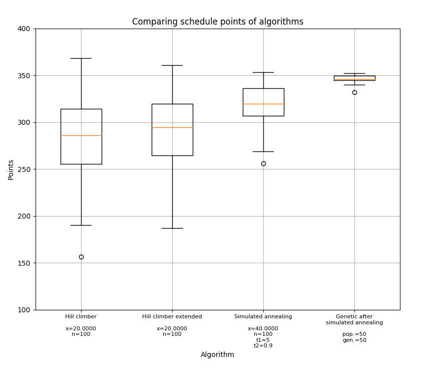
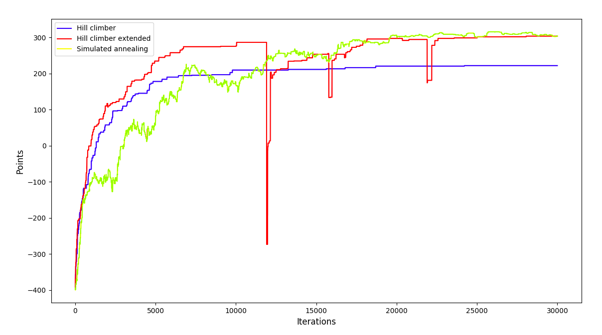

### Resultaten

## Vergelijken van algoritmes
In de onderstaande afbeeldingen zijn de roosterpunten die door de 3 verschillende algoritmes (hill climber, hill climber extended en simulated annealing) zijn gegenereerd. De data hiervan is te vinden in 'algorithm_points_results.csv'

## schedule.html
Het uiteindelijke rooster wordt gegeneerd aan de hand van een van de 4 algoritmes; hill climber, hill climber extended, simulated annealing of genetic algorithm.

Het rooster kan geopend worden met deze link:

### https://annemijnd.github.io/safariteam/results/schedule.html

### Structuur van het rooster
Het rooster bestaat uit totaal 140 slots:
  - 5 dagen;
  - 4 tijdslots per dag;
  - 7 zalen per tijdslot;
